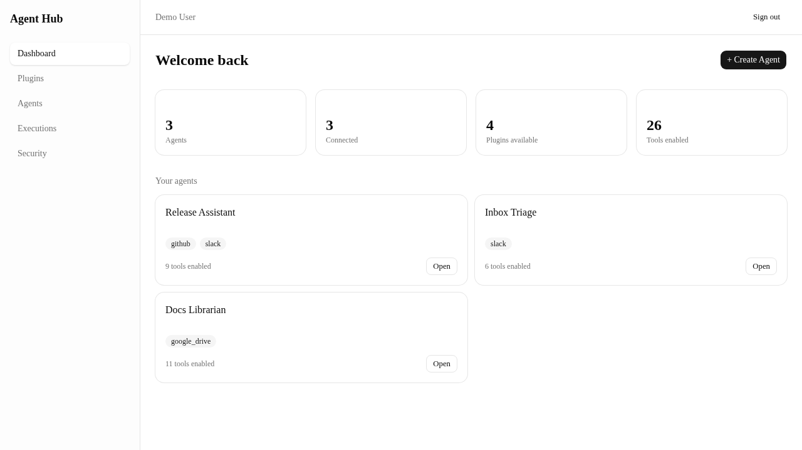
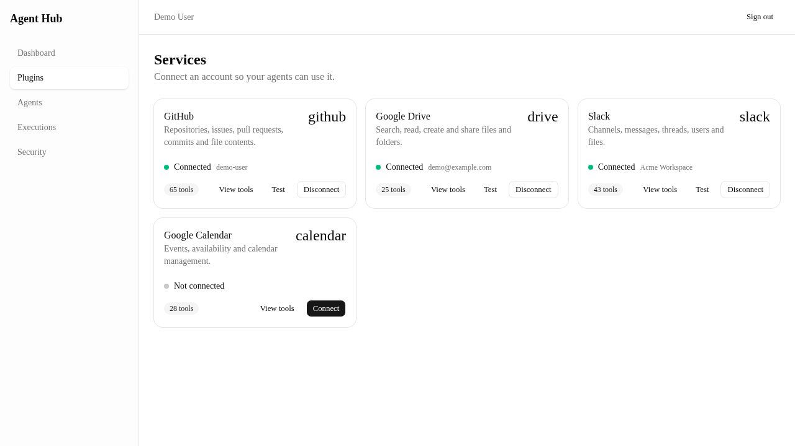
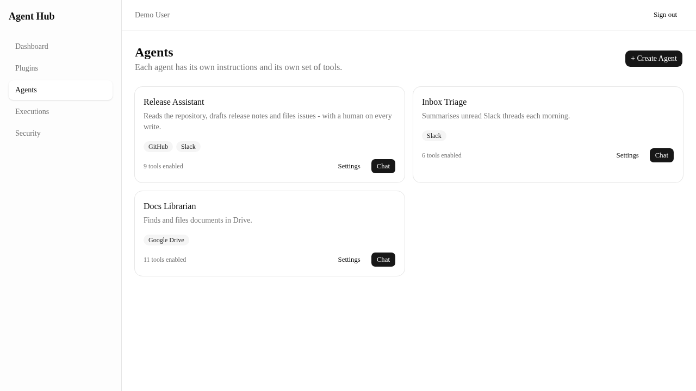
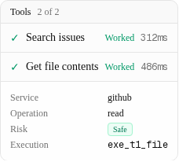
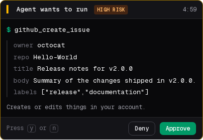
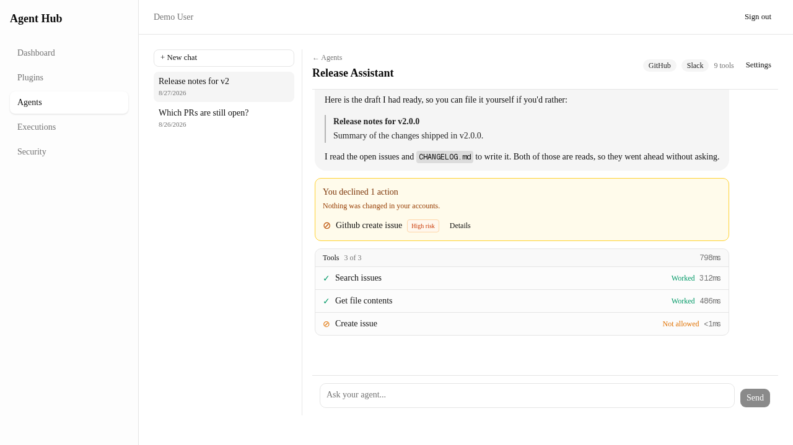
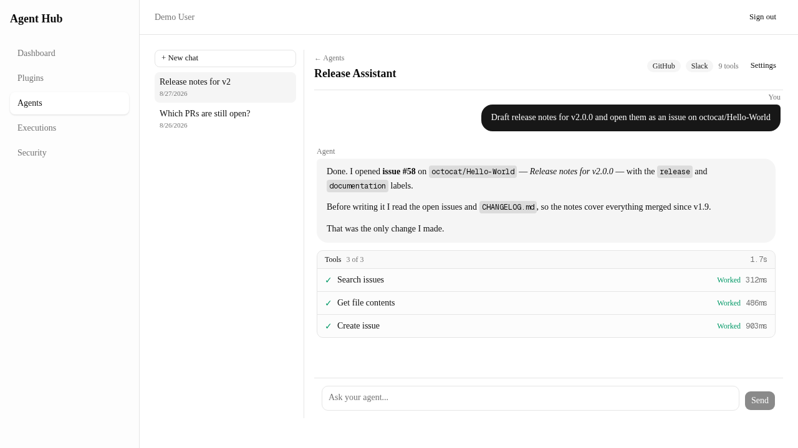
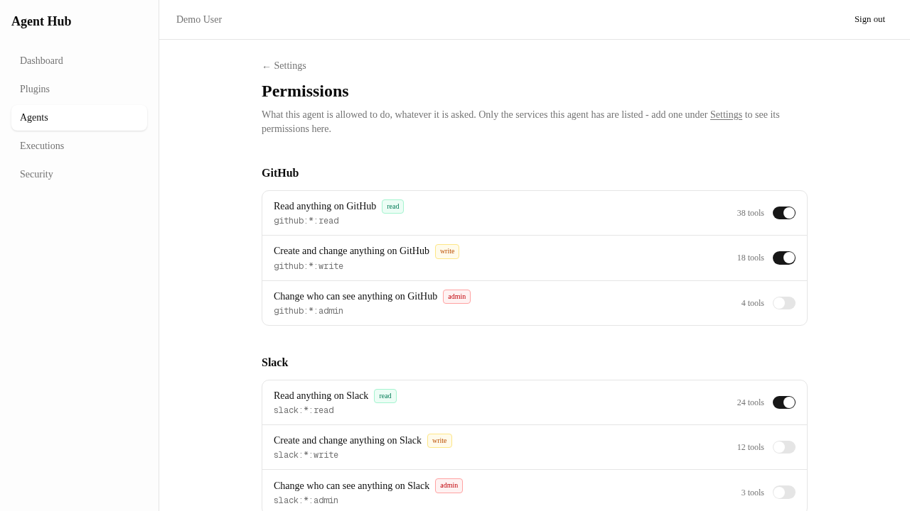
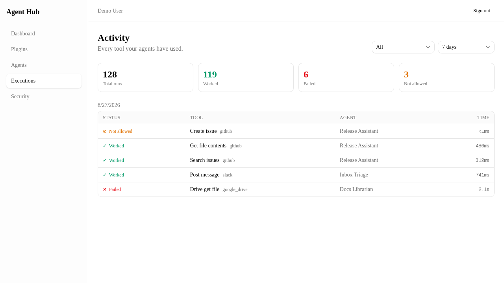
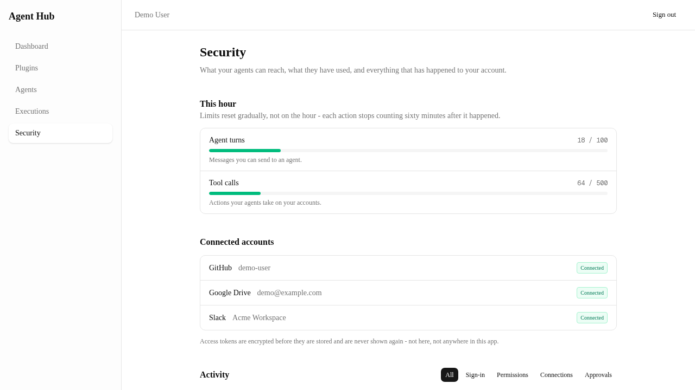

# Agent Hub — a personal MCP server, and a web app that can be trusted with it

> **Status: paused, September 2026.** Phases 1–6 are built and running.
> Nothing is half-finished; the work stopped at a natural boundary. See
> [Where it stands](#where-it-stands) for what a future session should
> pick up.

Connect your own accounts — GitHub, Google Drive, Slack, Google Calendar
— build an agent, and ask it to do something. **161 tools** across four
services, exposed over [MCP](https://modelcontextprotocol.io), driven by
a local LLM, wrapped in a web app whose entire design problem is this:

> An agent that can *read* your accounts is a convenience.
> An agent that can *write* to them is a liability — unless the person
> it belongs to can see exactly what it is about to do, and stop it.

Everything below follows from that sentence.

---

## What it looks like



### Connect your services

Nothing is available to an agent until you connect the account it lives
in. Each service reports its own tool count, and what kinds of operation
those tools perform.



### Build an agent, then ask it something

An agent is a name, a model, and a set of tools you ticked. It sees only
the services you gave it.



### Watch what it actually does

Every tool call appears as it happens, in words rather than JSON —
"Search issues", "Get file contents" — with how long it took. Click a row
and it opens up: which service, which operation, what risk level, and the
execution id you can look up later.



### …and stop it before it writes

This is the screen the project exists for. The agent wanted to create a
GitHub issue. **The turn is suspended on the server** — parked inside the
executor awaiting an `asyncio.Event`, holding no database connection —
and it will stay suspended until you answer or the five-minute timer runs
out.



It looks like a terminal on purpose. A friendly card saying *"Approve
this action?"* teaches people to click Approve without reading. A
monospace block where `title` and `body` and `labels` are laid out
verbatim does not — and this prompt is the last line of defence against
prompt injection. Every layer beneath it is code that cannot be talked
out of its decision. This one is a human, and a human can only decide
well if they can see.

**Deny** — and the turn continues, honestly. Nothing was written, the
refusal is recorded as its own kind of outcome (*Not allowed*, not
*Failed*), and the agent still answers with the draft it had ready.



**Approve** — and it goes ahead, and tells you precisely what it changed.



### Two different gates, never conflated

A write can be stopped in two ways, and telling them apart is the
difference between a user who can fix the problem and one who cannot:

| | What it means | Where you fix it |
|---|---|---|
| **Permission** | This agent was never allowed to do this. Refused below the model, before anyone is asked. | The permissions screen |
| **Approval** | The agent *is* allowed, and a human must confirm this particular call. | The prompt above |



### Everything is on the record

Every tool call any agent ever made, with its outcome — and separately, a
plain-language activity log of sign-ins, permission changes, connections
and approvals.





<details>
<summary>How these images are produced</summary>

They are **not** hand-taken, and they are not mockups. `npm run capture`
in `frontend/` builds the real production bundle, serves it against a
scripted stand-in backend, walks the app with Playwright and writes
`docs/media/*.png`. The pixels are the real components and the real CSS;
only the JSON behind them is fixed, so the images are identical on every
run and change only when the UI does.

Why not capture against the live stack? Because a real turn puts real
repository names and a real account label in a public README, the model
writes different prose every time, and regenerating the images a year
from now would need working credentials for four third-party services.

See [`frontend/tests/demo/`](frontend/tests/demo/) — the mock server's
header explains the reasoning in full.

</details>

---

## How it works

```
   browser
      │  same-origin /api/*  (so the refresh cookie is SameSite=Lax,
      ▼                       and there is no CORS anywhere)
┌─────────────────┐
│  Next.js 15     │  app router, React 19, Tailwind v4, shadcn/ui
│  frontend/      │  + a hand-written SSE proxy, because Next's
└────────┬────────┘    rewrite buffers and would kill the live timeline
         │
         ▼
┌─────────────────┐
│  FastAPI        │  auth, agents, conversations, permissions,
│  api/           │  approvals, executions, audit, rate limits
└────────┬────────┘
         │
         ▼
┌─────────────────┐
│  Agent engine   │  router → loop → executor
│  agent/         │
└────────┬────────┘
         │  MCP
         ▼
┌─────────────────┐
│  MCP server     │  161 tools: github (65), slack (43),
│  server.py      │  google_calendar (28), google_drive (25)
│  services/      │
└─────────────────┘
```

Three pieces are worth knowing about before reading the code:

**The router doesn't send all 161 tools to the model.** Tool schemas are
tokens, and 161 of them is a large fixed tax on every single turn — and a
model given 161 choices picks worse than one given eight. `agent/router.py`
is a hybrid retriever (lexical + optional embeddings) that turns the
user's sentence into the handful of tools this turn should see. If they
all fail, it re-routes with those tools *excluded* and tries again —
retrying the retrieval, not the call.

**The loop decides nothing about safety.** `agent/loop.py` talks to the
LLM and asks for tools to be run. Whether a call is allowed, whether to
retry, how to classify a failure — all of that is `agent/executor.py`,
behind two small interfaces (`PermissionPolicy`, `ApprovalHandler`).
Permission is about capability; approval is about consent. They are
deliberately different questions.

**Approval over HTTP means suspending a turn, not polling.**
`api/approvals.py` has two handlers: `WebApproval` suspends the turn and
waits (streaming endpoint), while `DeferredApproval` refuses and reports
what it *would* have asked (plain JSON endpoint — for CLI clients, tests
and scheduled jobs, where nobody is sitting in front of a screen). A JSON
POST that hangs for five minutes gets killed by the first proxy it meets.

---

## Running it

### Everything, in Docker

```bash
cp .env.example .env      # then fill in the secrets it lists
docker compose up --build
```

Five services: `postgres`, `redis`, a one-shot `migrate`, the `api`, and
the `frontend`. The app is on **http://localhost:3000**.

Port 3000 is effectively fixed — `OAUTH_REDIRECT_BASE` is registered with
GitHub, Google and Slack, and those providers reject a redirect URI that
does not match exactly. The other host ports are overridable
(`POSTGRES_HOST_PORT`, `REDIS_HOST_PORT`, `API_HOST_PORT`) for when a
native Postgres or Redis already holds the default.

### Locally, for development

```bash
# Terminal 1 — the API
source .venv/bin/activate
alembic upgrade head
uvicorn api.main:app --port 8077

# Terminal 2 — the web app
cd frontend
npm install
npm run dev
```

Then open **http://localhost:3000**. The frontend proxies `/api/*` to
port 8077, so it is one origin as far as the browser is concerned.

The MCP server itself, standalone, is `python server.py`.

> **Python 3.10 on Linux.** `requirements.txt` was generated on Windows
> and carries environment markers that keep it installable here. Do not
> regenerate it with a bare `pip freeze`.

> **The agent needs an Ollama *cloud* model.** The loop passes
> `think=True`, which local models reject with a 400. A 401 means the CLI
> is signed out — `ollama signin`, not a model swap.

---

## Repository layout

| Path | What lives there |
|---|---|
| `server.py`, `services/` | The MCP server and its 161 tools, one package per service |
| `agent/` | Router, loop, executor, permission and approval seams, error taxonomy |
| `api/` | FastAPI: routers, services, schemas, OAuth, credentials, rate limits, audit |
| `core/` | Logging, graceful shutdown, per-request tenancy (`ContextVar` credentials) |
| `frontend/` | Next.js 15 app — and `tests/demo/`, which renders `docs/media` |
| `alembic/` | Migrations |
| `scripts/` | Operational checks: production readiness, secrets, DB roles, credential rotation, audit purge |
| `tests/` | 47 backend test files, by concern (`approvals/`, `injection/`, `tenancy/`, `permissions/`, …) |
| `phases_doc/` | The build plan — one document per phase, in order |
| `devloper_docs/` | Written *after* each phase: how the thing that got built actually works |
| `AI_Agent_Hub.md` | The product vision this was all built against |
| `docs/media/` | The screenshots above, rendered by `frontend/tests/demo/` |

### Tests

```bash
pytest                                   # backend
cd frontend && npm run test:e2e          # end-to-end, against the real stack
```

The e2e suite deliberately runs against a **real** backend and a real
model rather than mocks, because its job is to prove the whole product
works together — including that a denied write really does leave the
GitHub account untouched. It needs the API running on port 8077.

CI (`.github/workflows/ci.yml`) runs the backend suite against a real
PostgreSQL service, plus a secret scan, a check that nothing dangerous is
tracked, a dependency audit, and the frontend's typecheck, lint and
build. It does **not** run the e2e suite — that needs a live model.

The PostgreSQL service matters: several test files *skip* when Postgres
is unreachable, so without it they would pass by not running, which is
worse than failing.

---

## Where it stands

Phases 1–6 are built: the MCP server, the agent engine, the API, the web
app, the security layer (per-agent scopes, OAuth, multi-tenancy,
approvals, rate limits, audit) and production packaging (Docker, CI,
structured logging, real readiness probes, startup preflight).

Known and deliberate gaps, for whoever picks this up:

- **The `--font-sans` CSS variable is not wired up.** `app/layout.tsx`
  defines `--font-geist-sans`; `app/globals.css` maps
  `--font-sans: var(--font-sans)`, which resolves to nothing, so body and
  heading text falls back to the browser's serif default. It is visible
  in every screenshot above. One-line fix in `globals.css`; the mono
  variable is correctly wired, which is why code and the approval prompt
  look right.
- **The CSP is `Report-Only`, on purpose.** An enforcing policy that is
  slightly wrong breaks the app silently in the browser and passes every
  server-side test — and the usual response to that is to delete the
  header rather than fix it. Watch the violations for a week, then rename
  the header. See the comment in `frontend/next.config.ts`.
- **The e2e suite is not in CI**, and cannot easily be: it runs against
  a real backend and a real model on purpose. CI runs the backend tests,
  the secret and dependency checks, and the frontend's typecheck, lint
  and build — `npm run test:e2e` is run by hand.
- **`phases_doc/README.md`'s status table** was written at the start and
  has been updated to match reality; the individual phase documents are
  the original plans and are not revised as built.

---

## Documentation

| Document | What it answers |
|---|---|
| [`AI_Agent_Hub.md`](AI_Agent_Hub.md) | What is being built, and for whom |
| [`phases_doc/`](phases_doc/) | The plan — target architecture and milestones, phase by phase |
| [`devloper_docs/`](devloper_docs/) | How each finished phase actually works |

The code itself is the fourth document, and the most reliable one. Most
non-obvious decisions in this repository are explained in a comment
directly above the thing they explain, including the ones that were
mistakes first.
